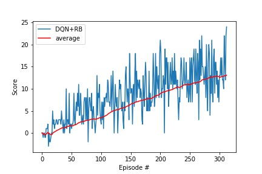
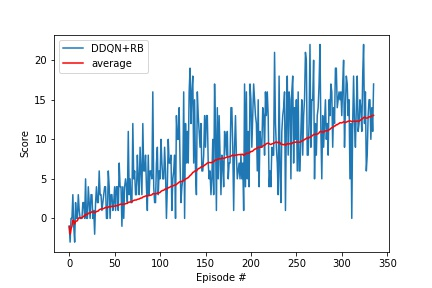
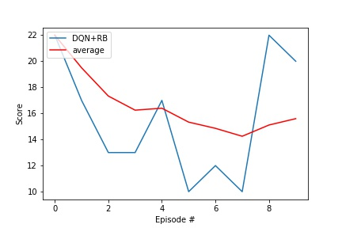
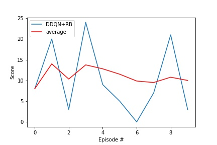

### Approach

These are main steps for developing an agent to solve Banana collection environment:

* Install the environment and equired dependencies.
* Denfine the environment and examine state and action space.
* Take random action in the environmenbt and collect the feedback. This establishes the baseline.
* Implement learning algorithm(s)
* Define basic Deep Q-Network (DQN) and Double Deep Q-Network (DDQN) agents.
* Train DQN and DDQN agents and save trained models for each agent.
* Plot the training results.
* Test DQN and DDQN agents.
* Plot the testing resutls.

### Learning Algorithm

Learning algorithm is used to find an optimal policy that maximizes the reward for the agent. The optimal policy is discovered discovered by interacting with the environment and receiving environment feedback. Through interactions the agent learngs the optimal policy policy by mapping environment states to best actions i.e. actions the yield the highest reward. This process is know as Q-Lenaring. Q-Learning algorithm consists of multiple components described in the sections below.

#### Deep Q-Network

Deep Q-Network (DQN) uses Q-Function that estimates expected reward for all actions for all environment states. In DQN a neural network (NN) is used to approximate Q-Fuction. In this project I constructed a fully connected NN with 3 layers with 64, 64 and 4 (size of the action space) nodes. I used RELU activation function for the first two layers. The NN implementation can be found [here](dqn/model.py).

#### DQN Agent

Basic DQN Agent used in this project implments all required log for interacting with the environment and learning the optimal policy. It also provides train() and test() methods for training and testing the agent. The DQN source code can be found [here](dqn/agent.py)

#### Double Deep Q-Network Agen

In this project I also used Double Deep Q-Network (DDQN) agent. DDQN was introduced to overcome a problem of [overestimating Q-values](https://www.ri.cmu.edu/pub_files/pub1/thrun_sebastian_1993_1/thrun_sebastian_1993_1.pdf). DDQN addresses this issue by having two sets of NN parameters one used to select action and another to evaluate it. The DDQN agent is a subclass of DQN agent it reuses all logic and underlying neural networks. It overrites learn() method to implement the logic of using diferent sets of parameters to select and evalutation action. DDQN agent source code can found [here](dqn/doubleagent.py).

#### Experience Replay

Both DQN and DDQN agents use Experience Replay. Experience Replay logic inlcudes replay buffer that storegs history of agent interactions with the environment also known as experiences. The agent then can sample stored experiences during learning process thus breaking correlation between consequtive experiences. This imporvoes learning process by preventing Q-Larning algorithm becoming biased towards sequential experiences. The implementation of the replay buffer can be found
[here](dqn/replaybuffer.py).

#### Epsilong Greedy

Both DQN and DDQN agents in this project employ epsilong greedy action selection during traing process. This enables the algorithm to balance exploring and exploiting during the learing by randomly picking actions instead of policy action based on probability defined by epsilon hyperparameter. DQN and DDQN agents train() method accepts paremeters to set starting and endiing epsilon values as well as epsilon decay. The best (fastest to solve the environment) epsilon parameters discovered through experimentation: eps_start=1.0, eps_end=0.02, eps_decay=0.98

### Training Performance 

#### DQN Agent training log

```
Episode 100	Average Score: 3.44
Episode 200	Average Score: 8.74
Episode 300	Average Score: 12.72
Episode 313	Average Score: 13.09
Environment solved in 213 episodes!	Average Score: 13.09
```

#### DDQN Agent training log

```
Episode 100	Average Score: 3.23
Episode 200	Average Score: 8.37
Episode 300	Average Score: 12.09
Episode 336	Average Score: 13.03
Environment solved in 236 episodes!	Average Score: 13.03
```

#### Training peformance graphs

The graphs below depict DQN and DDQN training scores




### Testing Performance

#### DQN Agent testing log

```
Episode 1	Average Score: 22.00
Episode 2	Average Score: 19.50
Episode 3	Average Score: 17.33
Episode 4	Average Score: 16.25
Episode 5	Average Score: 16.40
Episode 6	Average Score: 15.33
Episode 7	Average Score: 14.86
Episode 8	Average Score: 14.25
Episode 9	Average Score: 15.11
Episode 10	Average Score: 15.60
```

#### DDQN Agent testing log

```
Episode 1	Average Score: 8.00
Episode 2	Average Score: 14.00
Episode 3	Average Score: 10.33
Episode 4	Average Score: 13.75
Episode 5	Average Score: 12.80
Episode 6	Average Score: 11.50
Episode 7	Average Score: 9.86
Episode 8	Average Score: 9.50
Episode 9	Average Score: 10.78
Episode 10	Average Score: 10.00
```

#### Testing performance graphs

The graphs below depict DQN and DDQN training scores




### Ideas for Future Work

In this project I used two approaches: DQN and DDQN with Experience Replay which solved the enviroment by getting +13 average reward relatively easily. However there are other approaches and improvements I could explore:

- Implement [Prioritized Experienced Replay](https://arxiv.org/abs/1511.05952).
- Implement [Dueling Q-Networks](https://arxiv.org/abs/1511.06581).
- Implement [Rainbow](https://arxiv.org/abs/1710.02298) that combines all proposed imporovents for the orignal DQN.
- Setup local environment and watch trained agents in action.

After completing this project I'm planning to work optional Learn from Pixels solution presents a very intersiting variation on the orignal project problem. I'm curious to see how CNN based model would perform in this setup.

### Trained Models

* DQN Agent: dqn-basic-replay.pth
* DDQN Agent: dqn-double-agent.pth
